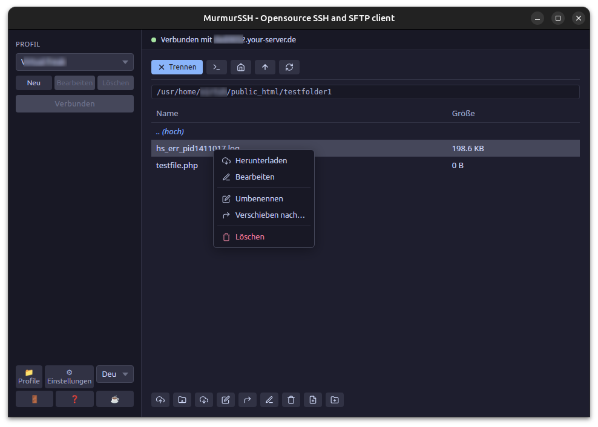
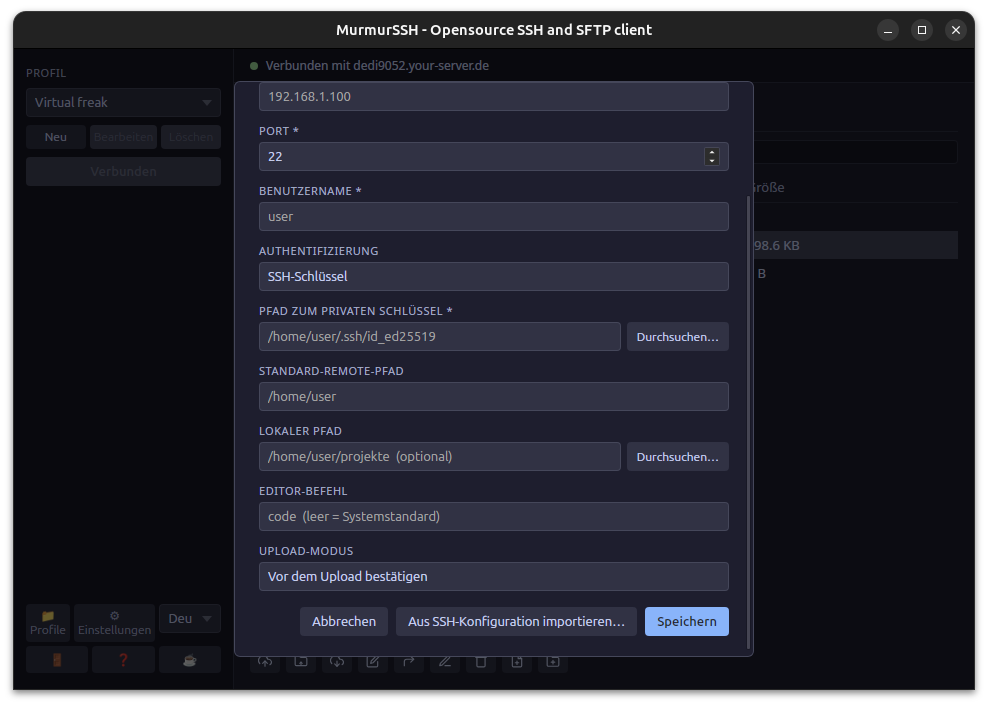
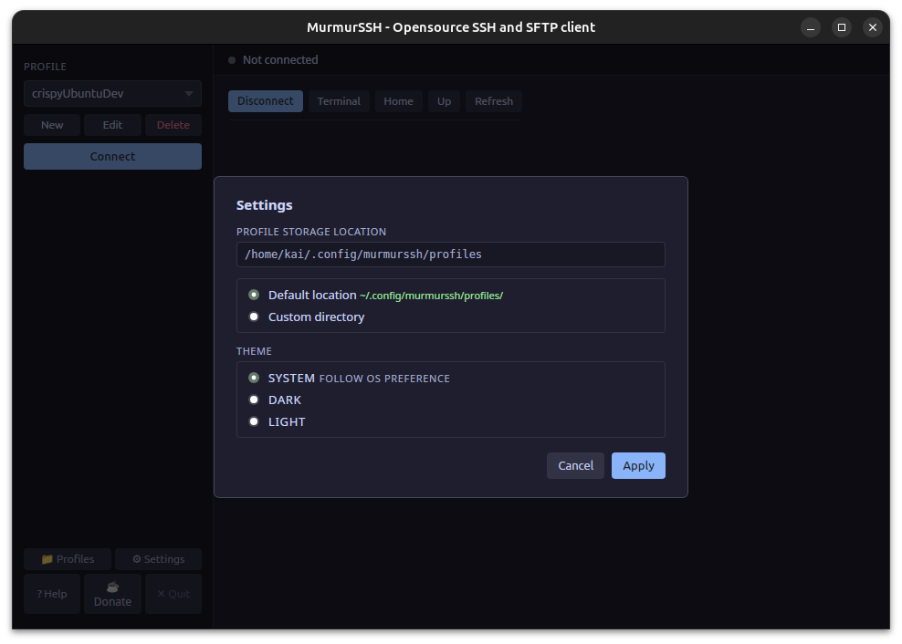

# MurmurSSH

**A minimal, local-first SSH, SFTP, and FTP client for Linux.**

MurmurSSH is a lightweight desktop application for managing SSH connections and browsing remote files over SFTP or FTP. It is designed for Linux users who want a simple, profile-based tool without cloud accounts, telemetry, or unnecessary complexity.

Built with [Tauri](https://tauri.app) and Rust. Free to use, free to modify, free to contribute to.

**Website:** [murmurssh.kai-schultka.de](https://murmurssh.kai-schultka.de)

**Available languages:** English, German, Netherland, France.

---

## What it does

- **Multi-protocol support** — connect via SSH (terminal + file browser), SFTP (file browser only), or FTP (file browser only). Port is pre-filled automatically for each protocol.
- **Profile management** — save connection profiles locally with name, host, port, username, and auth settings. No account required.
- **SSH sessions** — launch an SSH connection directly in your system terminal with one click.
- **Split-pane file browser** — a local file browser panel sits alongside the remote browser, so you can see both sides at once. The panel is toggleable and its position (left or right) is configurable in Settings.
- **SFTP/FTP remote browser** — browse remote directories, upload files and folders, download files and folders, delete, rename, move, and create files and directories. Works identically over SFTP and FTP.
- **Drag and drop** — drag local files onto the remote browser to upload; drag remote entries onto the local browser to download. Drop files or folders from your OS file manager onto the remote browser to upload.
- **Real-time transfer progress** — progress bar with live speed display (e.g. `2.1 MB/s`) during every upload and download. Byte-level fill for SFTP transfers; per-file updates for FTP and folder operations.
- **Activity log** — a live log panel shows connection events, transfer status, and errors while you work.
- **Remote file editing** — open a remote text file in your local editor. When you save, MurmurSSH uploads the changes back automatically or asks for confirmation first.
- **Multiple auth methods** — SSH key, SSH agent, or password authentication.
- **Optional password saving** — choose whether to save a password locally (machine-only) or inside the profile file (portable), or not at all. SSH key passphrases are never saved.
- **Host key verification** — unknown host keys are shown with their fingerprint before you accept them. Trusted keys are stored locally.
- **Keyboard shortcuts** — F5 refresh, F2 rename, F11 terminal, Delete, Ctrl+A, Enter, Escape. Full list in the Help dialog.
- **Fully local** — all profiles, settings, and credentials stay on your machine. No cloud, no sync, no telemetry.

---

## Screenshots

Screenshots are in [`docs/screenshots/`](docs/screenshots/).





---

## Installation

### Requirements

- Ubuntu 22.04 or later, or any compatible Debian-based Linux
- `x-terminal-emulator` (pre-installed on most Ubuntu systems)
- `xdg-utils` (pre-installed on most Ubuntu systems)

### Install system dependencies (build only)

```bash
sudo apt install \
  libwebkit2gtk-4.1-dev \
  libgtk-3-dev \
  libayatana-appindicator3-dev \
  librsvg2-dev \
  libssh2-1-dev
```

### Install from .deb

Download the latest `.deb` release from the [Releases](../../releases) page and install it:

```bash
sudo dpkg -i murmurssh_*.deb
```

### Install from .AppImage (portable)

Download the `.AppImage` from the [Releases](../../releases) page. No installation needed — make it executable and run it directly:

```bash
chmod +x MurmurSSH_*.AppImage
./MurmurSSH_*.AppImage
```

The AppImage bundles all dependencies and runs on most Linux distributions without installation.

---

## Building from source

You need [Rust](https://rustup.rs) (stable toolchain) and Node.js 18 or later.

```bash
# Clone the repository
git clone https://github.com/andrenalin282/MurmurSSH.git
cd MurmurSSH

# Install Node dependencies
npm install

# Start in development mode with hot reload
npm run tauri dev
```

To build a release package:

```bash
# Generate icons from a 1024×1024 PNG (required once before building)
npm run tauri icon path/to/icon.png

# Build .deb and .AppImage
npm run tauri build
```

Output is written to `src-tauri/target/release/bundle/`.

---

## Usage

### Profiles

Create a profile for each server you connect to:

1. Click **New** in the sidebar
2. Enter the display name, host, port, and username
3. Select the **Protocol**:
   - **SSH** — SSH terminal session + SFTP file browser. Port defaults to `22`.
   - **SFTP** — file browser only (no terminal). Port defaults to `22`.
   - **FTP** — file browser only, for servers that only support FTP. Port defaults to `21`.
4. Choose an authentication method (SSH/SFTP only):
   - **SSH Key** — pick your private key file with the Browse button
   - **SSH Agent** — delegates to your running `ssh-agent`
   - **Password** — entered at connection time; you can choose whether to save it
5. Optionally set:
   - **Default Remote Path** — the directory opened when you connect
   - **Local Path** — a local folder used as the default for uploads and downloads
   - **Editor Command** — the command used to open files for editing (blank = system default)
   - **Upload Mode** — confirm before upload, or auto-upload on file save
6. Click **Save**

The last used profile is restored automatically on startup.

### Connecting

Select a profile and click **Connect**. MurmurSSH will:

1. Verify the host key / authenticate (SSH/SFTP — prompts for password or passphrase if needed)
2. For **SSH** profiles: also open an SSH terminal session in your system terminal
3. Load the file browser (all protocols)

While connecting, a cancel button appears in the toolbar so you can abort a slow or unreachable connection.

### File browser (SFTP / FTP)

The file browser works the same way over SFTP and FTP.

| Action | How |
|---|---|
| Navigate | Click a directory row or type a path in the path input and press Enter |
| Go up | Click `..` or the **Up** button |
| Upload file | Click **Upload** → file picker opens, starts in your configured local path if set |
| Upload folder | Click **Upload Folder** → folder picker opens, uploads entire directory recursively |
| Upload via drag | Drag files from your local browser panel or OS file manager onto the remote file list |
| Download | Select one or more files/folders → **Download** → saves to your configured local path, or opens a save dialog |
| Download via drag | Drag remote rows onto the local browser panel, or onto the drop zone below the action bar |
| Edit | Select a text file → **Edit** → opens in your editor → saves back on file save |
| Rename | Select a single entry → **Rename**, or press **F2** |
| Move | Drag rows onto a folder row or `..`, or select entries → **Move to…** |
| Delete file | Select a file → **Delete** → confirm |
| Delete folder | Select a folder → **Delete** → confirm recursive deletion |
| New file | Click **New File** → enter a name |
| New folder | Click **New Folder** → enter a name |
| Refresh | Click **Refresh** or press **F5** |
| Open terminal | Click the terminal icon in the toolbar or press **F11** (SSH profiles only) |

During transfers, a progress bar shows the current filename, percentage, and live transfer speed (e.g. `1.4 MB/s`). The activity log below the file list shows what happened and any errors.

### Local file browser

Click the split-pane icon in the toolbar (before the terminal icon) to show or hide the local file browser. When the panel is hidden the icon is highlighted so the state is always visible.

The local browser shows your local filesystem and lets you:
- Navigate by clicking folders, using the **Up** / **Home** buttons, or typing a path
- Drag local files onto the remote browser to upload them
- Receive drops from remote rows (drag remote → drop on local browser = download)

The last visited path is saved per profile. For shared (portable) profiles each OS user gets their own remembered path.

**Panel position** — go to Settings → Local browser position to move the panel to the right side of the remote browser instead of the left.

### Credential storage

When connecting with password authentication, you choose how to handle the password:

| Option | What happens |
|---|---|
| **Don't save** (default) | Prompted every time. Nothing written to disk. |
| **Save on this PC only** | Plaintext file at `~/.config/murmurssh/secrets/` with `0600` permissions. Does not travel with the profile. |
| **Save in profile file** | Plaintext inside the profile JSON. Portable to other PCs, but anyone with access to the file can read it. |

SSH key passphrases are **never saved**. They are prompted at connection time and discarded immediately after.

To clear a saved password: open the profile in **Edit** → **Clear Saved Credential**.

### SSH key compatibility

If your SSH private key is stored on a mounted or network filesystem, the system `ssh` client may reject it with "UNPROTECTED PRIVATE KEY FILE" because the filesystem does not honour UNIX file permissions as expected by OpenSSH.

When this happens, MurmurSSH will prompt you to create a local runtime copy of the key:

- The copy is stored in `~/.config/murmurssh/runtime-keys/` with `0600` permissions
- The terminal session uses the copy instead of the original
- The original key file is **never modified**
- The copy is **temporary** — it is deleted when you disconnect or when the app starts up

No passphrase is stored. If the key requires a passphrase, the terminal will still prompt you interactively.

---

## Configuration

All data is stored locally in `~/.config/murmurssh/`:

```
~/.config/murmurssh/
  profiles/        # One JSON file per saved profile
  settings.json    # App settings (last used profile, etc.)
  secrets/         # Machine-local saved passwords (0600, never synced)
  workspace/       # Local cache of files opened for editing
  known_hosts      # Accepted SSH host key fingerprints
  runtime-keys/    # Temporary key copies for terminal compatibility (0600, deleted on disconnect)
  logs/            # Application logs
```

Profiles are plain JSON and can be edited manually or copied between machines.

---

## Project structure

```
src/                    # Vanilla TypeScript frontend (no framework)
  api/index.ts          # Typed wrappers for all Tauri IPC commands
  components/           # DOM-based UI components
  types.ts              # Shared TypeScript types
  main.ts               # App entry point
src-tauri/src/
  models/               # Rust data types (Profile, Settings, FileEntry)
  services/             # Business logic (SSH, SFTP, FTP, profiles, secrets, workspace)
  commands/             # Tauri IPC handlers
  lib.rs                # Command registration
```

---

## Contributing

MurmurSSH is free and open source. Contributions are very welcome.

Whether it's a bug report, a small fix, a usability improvement, or documentation — all contributions are appreciated.

**Before opening a pull request:**

- Read `PRD.md` — it defines what this project is and is not
- Keep changes focused and minimal
- Prefer simple solutions over clever ones
- Stay within the existing architecture

**Good first areas to contribute:**

- Bug reports and reproducible test cases
- UI polish and accessibility improvements
- Documentation improvements
- Platform testing on Debian, Fedora, or other distributions

Please open an issue first for larger changes so we can discuss the approach before you invest time in it.

---

## License

MurmurSSH is released under the [MIT License](LICENSE).

---

## Known limitations

- Only one profile can be active at a time
- Folder deletion is recursive and permanent — there is no undo or trash recovery
- Binary files and files larger than 1 MB cannot be opened for editing
- Each SFTP/FTP operation opens a fresh connection — not optimised for rapid sequential use
- FTP byte-level progress is not available (suppaftp does not support mid-transfer callbacks); progress updates per file instead
- No Windows or macOS support — Linux only, by design
- Please report bugs via the [issue tracker](https://github.com/andrenalin282/MurmurSSH/issues)
